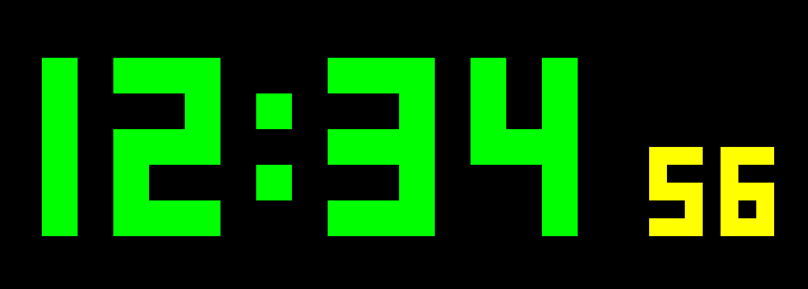
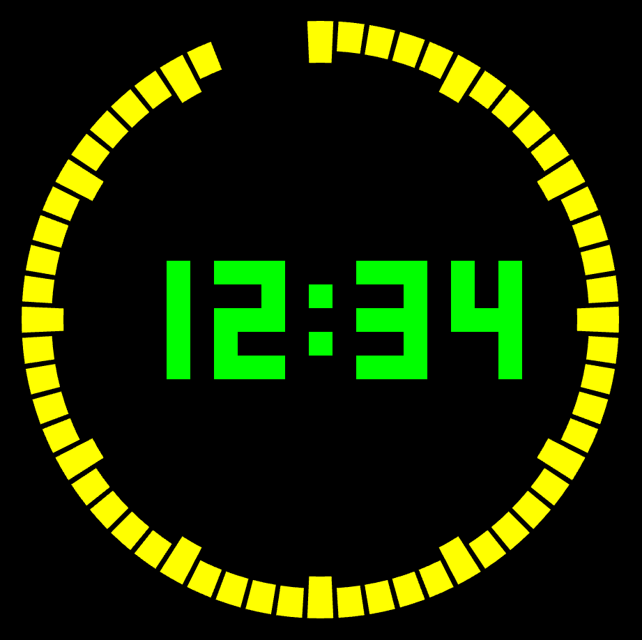

# ⏰ Pixel Clock
> **Неоновые часы на чистом JavaScript**<br>
> Для ценителей пикселей, ванильного JS и ретро-вибраций ⚡

## 🕹️ Версии проекта
В репозитории есть **две реализации часов**, каждая в своей папке:

| Версия | Описание | Скриншот |
|:------:|:---------|:---------|
| **[v1](./v1)** | Классические цифровые часы в духе «киберпанк-терминала» 😎 | <a href="./v1/screenshot.png" target="_blank"></a> |
| **[v2](./v2)** | Аналого-цифровой гибрид: часы в центре и сегменты-секунды по окружности 🕒 | <a href="./v2/screenshot.png" target="_blank"></a> |

## 🌟 Особенности
- 🧠 Чистый JavaScript
- 💾 Без зависимостей и сборщиков
- 🎨 Легко менять цвета и размер элементов через CSS
- 🪩 Эстетика старых электронных табло

## 🚀 Как запустить
```bash
    # Клонировать репозиторий:
    git clone https://github.com/andrewsalmin/pixel-clock.git
    
    # Перейти в папку проекта:
    cd pixel-clock
    
    # Перейти в нужную версию:
    cd v1  # или cd v2
    
    # Открыть файл index.html в браузере
```

## 🧩 Структура репозитория
```bash
    pixel-clock/
    │
    ├── v1/                 # Первая версия — прямоугольные цифровые часы
    │   ├── index.html
    │   ├── style.css
    │   ├── main.js
    │   └── screenshot.png
    │
    ├── v2/                 # Вторая версия — круглые часы с индикатором-секундомером
    │   ├── index.html
    │   ├── style.css
    │   ├── main.js
    │   └── screenshot.png
    │
    └── README.md
```

## 🧠 Как работают часы
🟩 v1 — Прямоугольные
- Каждая цифра отрисовывается как набор сегментов.
- Секунды подсвечиваются жёлтым — потому что могут.

🟡 v2 — Круглые
- Секунды визуализируются сегментами по окружности.
- Идеально подходит для воссоздания атмосферы 80-х в браузере.

## 💡 Идеи для будущих версий
- 🔉 Звуки "тикания"
- 📅 Отображение даты
- 💫 Анимация появления цифр
- 🌓 Возможность переключения темы

## 📜 Лицензия
Этот проект распространяется по лицензии [MIT](https://opensource.org/licenses/MIT).<br><br>

> “Время летит, а JavaScript всё ещё работает в браузере.”

<br><p align="center">🔔 <b>Stay tuned — больше версий впереди!</b></p>